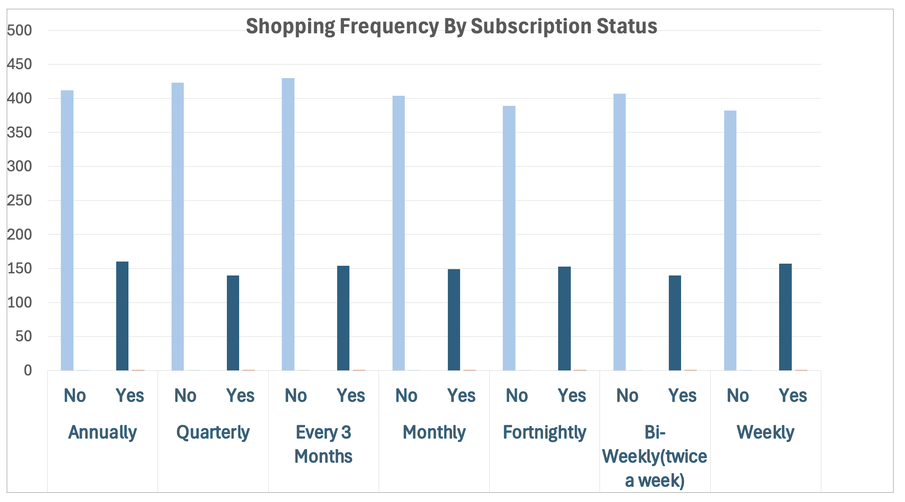
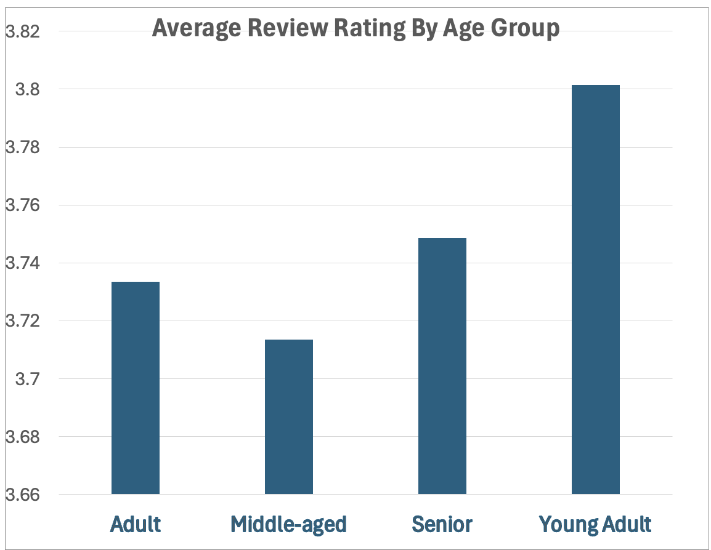

# Shopping Frequency vs Subscription Status

## 1. Key Finding
This chart compares shopping frequency (a measure of customer loyalty) with subscription status. 
There is no significant difference showing that higher shopping frequency leads to higher subscription rates. 
Even among the most frequent shoppers, the proportion of subscribers does not increase meaningfully. 
This suggests that customer loyalty is not strongly influencing subscription adoption.

## 2. Implications & Next Steps
This is concerning because loyal customers benefit the most from subcriptions, yet don't seem to adopt them accodingly.
This lack of conversion highlights an opportunity to introduce new incentives and targeted marketing strategies 
aimed at repeat buyers to increase subscription rates.

# Average Review Rating by Age Group

## 1. Key Finding
This chart compares average review ratings across different age groups.  
There is no significant variation in ratings between groups, as all averages fall within a very narrow range.  
This suggests that age does not strongly influence how customers rate their experiences.

## 2. Implications & Next Steps
This is notable because businesses often expect different age groups to have varying satisfaction levels.  
The consistency in ratings indicates that current offerings appeal broadly across demographics.  
This opens the opportunity to maintain a unified customer experience strategy while exploring subtle, targeted enhancements for specific age segments.
